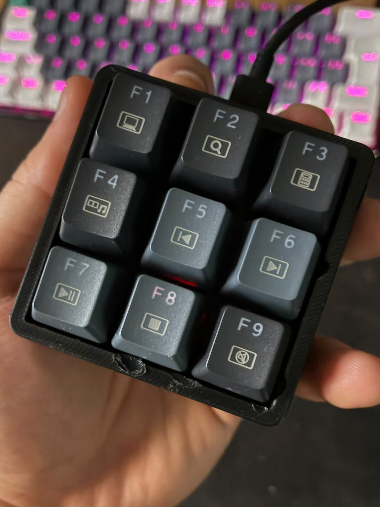

# 🎛️ StreamDeck-Embeeded-System

<p align="center">
  
</p>

<p align="center">
  <strong>Macro Pad de Teclas Físicas de 9 Botões baseado em STM32F103C8T6 (BluePill) e USB Custom HID</strong><br>
  Projeto desenvolvido para a disciplina de <strong>Sistemas Embarcados I</strong><br>
  <strong>FEELT</strong> — Faculdade de Engenharia Elétrica | <strong>UFU</strong> — Universidade Federal de Uberlândia
</p>

---

## 👥 Integrantes do Projeto

| Nome | Matrícula | Curso |
| :--- | :---: | :---: |
| **Vicenzo De Marco Olivalves** | `12421ECP006` | Engenharia de Computação |
| **Mateus Henrique Gonçalves** | `12311ECP021` | Engenharia de Computação |
| **Gustavo Martins** | `12111ETE002` | Engenharia Eletrônica |
| **Bruna Silva** | `12021ETE007` | Engenharia Eletrônica |

---

## 📌 Visão Geral do Projeto

O **StreamDeck-Embeeded-System** é um dispositivo de entrada físico (*Macro Pad*) composto por uma matriz 3x3 de chaves mecânicas em um case impresso em 3D. O sistema é controlado pelo microcontrolador **STM32F103C8T6 (ARM Cortex-M3 @ 72 MHz)** rodando um firmware em C desenvolvido no **STM32CubeIDE** utilizando a biblioteca ST HAL.

O dispositivo se comunica nativamente com o computador através da classe **USB Custom HID (Human Interface Device)**, enviando relatórios de 8 bytes com scancodes que variam de **F13 a F21** (`0x68` a `0x70` em Hexadecimal). Como o driver USB HID é nativo nos sistemas operacionais (Windows, Linux e macOS), o dispositivo funciona no modo **Plug-and-Play**, sem a necessidade de instalar drivers externos ou usar portas seriais (USART/UART).

Além do hardware e firmware, o repositório inclui um **Dashboard Web Interativo** para simulação em sala de aula, com osciloscópio de sinais GPIO, inspeção de pacotes USB e telemetria de registradores em tempo real.

---

## 🛠️ Especificações Técnicas de Hardware & Firmware

* **Microcontrolador:** STM32F103C8T6 (ARM Cortex-M3, 32-bit).
* **Frequência da CPU (SYSCLK):** 72 MHz (Cristal HSE 8 MHz × PLL 9).
* **Frequência USB (USBCLK):** 48 MHz (Divisor PLL 1.5).
* **Topologia de Entrada:** Matriz Multiplexada 3x3 (3 Linhas × 3 Colunas).
* **Configuração de Saída das Linhas (PA1, PA2, PA3):** `GPIO_MODE_OUTPUT_OD` (Open-Drain).
* **Configuração de Entrada das Colunas (PA4, PA5, PA6):** `GPIO_MODE_INPUT` com `GPIO_PULLUP` interno.
* **Debouncing:** Filtro por software não-bloqueante com janela de estabilidade de 40 ms via `HAL_GetTick()`.
* **Pacote USB HID:** Relatório padrão de 8 Bytes (Byte 2 = `0x68 + tecla_id`).

---

## 📐 Tabela de Mapeamento de Pinos & Teclas (Matriz 3x3)

| Botão | Tecla HID | Hex Code | Linha (GND Out) | Coluna (PullUp In) | Ação no Dashboard Web |
| :---: | :---: | :---: | :---: | :---: | :--- |
| **#1** | **F13** | `0x68` | PA1 | PA4 | Soundboard SFX (Sintetizador Web Audio) |
| **#2** | **F14** | `0x69` | PA1 | PA5 | Mutar / Desmutar Microfone (Estúdio On-Air) |
| **#3** | **F15** | `0x6A` | PA1 | PA6 | Alternar Cenas (Slide / Webcam / STM32 Code) |
| **#4** | **F16** | `0x6B` | PA2 | PA4 | Iniciar / Pausar Cronômetro da Apresentação |
| **#5** | **F17** | `0x6C` | PA2 | PA5 | Alerta em Tela Cheia para a Sala de Aula |
| **#6** | **F18** | `0x6D` | PA2 | PA6 | Efeitos Visuais de Iluminação LED |
| **#7** | **F19** | `0x6E` | PA3 | PA4 | Diagrama de Arquitetura da STM32 BluePill |
| **#8** | **F20** | `0x6F` | PA3 | PA5 | Gerador de Memes de Sistemas Embarcados |
| **#9** | **F21** | `0x70` | PA3 | PA6 | Celebração Final com Confetes & Fanfarra |

---

## 🌐 Dashboard Web & Simulador Interativo

O projeto acompanha uma aplicação Web completa desenvolvida em HTML5, CSS3 (Cyberpunk Glassmorphism) e JavaScript puro (100% offline) localizada na pasta [`dashboard/`](file:///c:/Users/vicen/Downloads/streamdeck/dashboard/index.html).

### Recursos da Interface:
* **Escuta em Tempo Real:** Captura os acionamentos físicos de F13 a F21 enviados pela placa STM32.
* **Telemetria dos Pinos GPIO:** Destaca quais pinos de Linha e Coluna foram ativados no momento da leitura.
* **Análise Técnica (Osciloscópio / Sinais Lógicos):** Desenha a forma de onda digital das bordas de descida (*falling edge*) dos pinos.
* **Inspeção de Pacotes USB:** Mostra a estrutura do buffer de 8 Bytes enviado pelo Endpoint `EP1 IN`.
* **Métricas do Microcontrolador:** Exibe a ocupação da memória Flash (23%), SRAM (14%) e o valor do registrador `GPIOA_CRL`.

Para abrir o simulador, basta dar um duplo clique no arquivo [`dashboard/index.html`](file:///c:/Users/vicen/Downloads/streamdeck/dashboard/index.html) em qualquer navegador web.

---

## 📂 Estrutura do Repositório

```text
StreamDeck-Embeeded-System/
├── streamdeck bluepill/      # Projeto em C do STM32CubeIDE (Firmware da STM32)
│   ├── Core/
│   │   ├── Inc/              # Cabeçalhos main.h, usb_device.h, etc.
│   │   └── Src/
│   │       ├── main.c        # Lógica principal, varredura da matriz e debounce
│   │       └── ...
│   ├── USB_DEVICE/           # Pilha USB Device Custom HID da ST
│   └── streamdeck bluepill.ioc # Configuração do projeto no STM32CubeMX
├── dashboard/                # Aplicação Web de Simulação & Análise Técnica
│   ├── index.html            # Interface gráfica do Dashboard (UFU/FEELT)
│   ├── styles.css            # Estilos Cyberpunk / Glassmorphism
│   ├── app.js                # Event listener, osciloscópio e sintetizador de som
│   └── ufu_logo.svg          # Logo vetorial oficial da UFU
├── integracoes/              # Scripts de integração com o SO e documentação
│   ├── streamdeck_hotkeys.ahk # Script em AutoHotkey v2 para comandos no Windows
│   ├── streamdeck_listener.py# Script em Python para log de telemetria no terminal
│   ├── gerar_pdf.py          # Script gerador da apostila técnica em PDF
│   └── GUIA_APRESENTACAO_OBS.md # Manual de apresentação e perguntas da banca
├── GUIA_ESTUDO_STREAMDECK_UFU.pdf # Apostila compilada para estudo e banca
└── streamdeck_hardware.png   # Foto do hardware físico montado
```

---

## 🚀 Como Compilar e Gravar o Firmware

1. Instale o **[STM32CubeIDE](https://www.st.com/en/development-tools/stm32cubeide.html)**.
2. Abra o STM32CubeIDE e selecione `File -> Import -> Existing Projects into Workspace`.
3. Navegue até a pasta [`streamdeck bluepill`](file:///c:/Users/vicen/Downloads/streamdeck/streamdeck%20bluepill) deste repositório e confirme a importação.
4. Conecte a placa **STM32F103C8T6 BluePill** usando um gravador **ST-Link V2**.
5. Clique no ícone de **Build** (martelo) e em seguida no ícone de **Run** (play) para gravar o projeto na placa.

---

## 🎓 Gabarito Técnico de Perguntas da Banca (Prof. Jeovane)

<details>
<summary><strong>1. Por que usaram Polling no while(1) em vez de Interrupções EXTI?</strong></summary>
Em uma matriz multiplexada (3x3), se usássemos interrupções EXTI nas colunas, ainda seria necessário desabilitar a EXTI e varrer as linhas manualmente para identificar o botão exato. Atrasos de de-bouncing dentro de uma ISR causariam estouro de contexto no NVIC (<em>stacking/unstacking</em>). A varredura por Polling no <code>while(1)</code> utilizando <code>HAL_GetTick()</code> realiza um de-bouncing não-bloqueante leve e seguro.
</details>

<details>
<summary><strong>2. Por que a linha é configurada em Open-Drain (GPIO_MODE_OUTPUT_OD) e não Push-Pull?</strong></summary>
O modo <code>Open-Drain</code> evita curto-circuito. Se duas teclas da mesma coluna fossem pressionadas simultaneamente e as linhas estivessem em Push-Pull (uma em 3.3V e outra em 0V), haveria um curto-circuito direto entre VCC e GND através dos botões. No modo Open-Drain, a linha ativa vai para 0V e as inativas ficam em alta impedância (<em>Hi-Z</em>).
</details>

<details>
<summary><strong>3. Como otimizar a escrita de pinos evitando condições de corrida (BSRR vs ODR)?</strong></summary>
Usando o registrador <code>GPIOx_BSRR</code>. O registrador <code>GPIOx_ODR</code> exige a sequência de leitura-modificação-escrita (vulnerável a interrupções concorrentes), enquanto o <code>BSRR</code> executa a alteração do estado do pino em uma <strong>única instrução de escrita atômica</strong> de 32 bits.
</details>

<details>
<summary><strong>4. Qual a diferença entre USB Custom HID e comunicação USART/UART?</strong></summary>
A USART/UART é serial assíncrona pino-a-pino que envia quadros de bits sob Baud Rates fixos e exige um conversor USB-Serial (FT232/CH340). O Stream Deck usa o periférico USB nativo da STM32 (PA11/PA12) sob a classe <strong>USB Custom HID</strong>. O Windows o reconhece diretamente como um teclado Plug-and-Play genérico (F13-F21) sem necessidade de drivers ou de porta serial.
</details>

<details>
<summary><strong>5. Por que as variáveis de controle foram declaradas como 'volatile'?</strong></summary>
A palavra <code>volatile</code> impede que o compilador C (GCC) aplique otimizações agressivas que mantenham os valores guardados em registradores da CPU ARM, forçando a leitura e escrita direta na memória SRAM a cada iteração, garantindo sincronismo no Debugger.
</details>

<details>
<summary><strong>6. Como é configurada a árvore de clocks para o barramento da USB?</strong></summary>
A USB exige obrigatoriamente 48 MHz. O cristal externo HSE de 8 MHz é multiplicado pelo PLL x9 gerando 72 MHz (SYSCLK). Esse sinal é dividido por 1.5 (<code>RCC_USBCLKSOURCE_PLL_DIV1_5</code>), entregando exatamente 48 MHz para o periférico USB.
</details>

---

<p align="center">
  Desenvolvido com 💙 pela equipe de Engenharia da <strong>FEELT / UFU</strong> — 2026.
</p>
