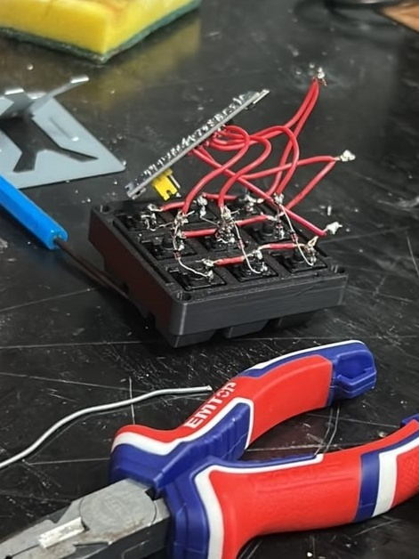

# 🎛️ StreamDeck-Embeeded-System

<p align="center">
  
  
</p>

<p align="center">
  <strong>Macro Pad Físico de 9 Botões baseado em STM32F103C8T6 (BluePill) e USB Custom HID</strong><br>
  Interface de controle e simulação desenvolvida em <strong>Python 3</strong><br>
  Projeto acadêmico para a disciplina de <strong>Sistemas Embarcados I</strong><br>
  <strong>FEELT</strong> — Faculdade de Engenharia Elétrica | <strong>UFU</strong> — Universidade Federal de Uberlândia
</p>

---

## 👥 Integrantes do Projeto

| Nome | Matrícula | Curso |
| :--- | :---: | :---: |
| **Vicenzo De Marco Olivalves** | `12421ECP006` | Engenharia de Computação |
| **Mateus Henrique Gonçalves** | `12311ECP021` | Engenharia de Computação |
| **Gustavo Martins** | `12111ETE002` | Engenharia Eletrônica |
| **Bruna Silva** | `12021ETE007` | Engenharia Eletrônica |

---

## 📌 Visão Geral do Projeto

O **StreamDeck-Embeeded-System** é um dispositivo de entrada físico (*Macro Pad*) composto por uma matriz 3x3 de chaves mecânicas soldadas manualmente em um case personalizado impresso em 3D. O controle do sistema é realizado pelo microcontrolador **STM32F103C8T6 (ARM Cortex-M3 @ 72 MHz)** executando um firmware em C de baixo nível desenvolvido no **STM32CubeIDE** com a biblioteca ST HAL.

O dispositivo se comunica nativamente com o computador via **USB Custom HID (Human Interface Device)**, transmitindo relatórios de 8 bytes com scancodes estendidos de **F13 a F21** (`0x68` a `0x70` em Hexadecimal). Como a classe USB HID é suportada nativamente pelo sistema operacional, o dispositivo funciona em modo **Plug-and-Play**, sem a necessidade de instalar drivers externos ou abrir portas seriais (USART/UART).

A aplicação de acompanhamento é iniciada por um **Servidor de Aplicação em Python 3 (`app.py`)**, que abre a interface gráfica interativa exibindo em tempo real o acionamento de cada tecla, osciloscópio de sinais GPIO, inspeção do pacote de 8 Bytes USB e métricas da arquitetura do microcontrolador.

---

## 🛠️ Especificações Técnicas de Hardware & Firmware

* **Microcontrolador:** STM32F103C8T6 (ARM Cortex-M3, 32-bit).
* **Frequência da CPU (SYSCLK):** 72 MHz (Cristal HSE 8 MHz × PLL 9).
* **Frequência USB (USBCLK):** 48 MHz (Divisor PLL 1.5).
* **Topologia de Entrada:** Matriz Multiplexada 3x3 (3 Linhas × 3 Colunas).
* **Configuração de Saída das Linhas (PA1, PA2, PA3):** `GPIO_MODE_OUTPUT_OD` (Open-Drain).
* **Configuração de Entrada das Colunas (PA4, PA5, PA6):** `GPIO_MODE_INPUT` com `GPIO_PULLUP` interno.
* **Debouncing:** Filtro por software não-bloqueante com janela de estabilidade de 40 ms via `HAL_GetTick()`.
* **Pacote USB HID:** Relatório padrão de 8 Bytes (Byte 2 = `0x68 + tecla_id`).

---

## 🏬 Placa de Circuito Impresso (PCB KiCad)

O projeto inclui o desenvolvimento completo do esquemático elétrico e do layout de **Placa de Circuito Impresso (PCB)** desenvolvida no **KiCad**, localizada no diretório [`PCB/PCB_macropad/`](file:///c:/Users/vicen/Downloads/streamdeck/PCB/PCB_macropad):

* 📄 **Esquemático Eletrônico (PDF):** [`PCB/PCB_macropad/sch_macropad_plote.pdf`](file:///c:/Users/vicen/Downloads/streamdeck/PCB/PCB_macropad/sch_macropad_plote.pdf)
* 📐 **Arquivos de Projeto KiCad:** `PCB_macropad.kicad_sch` e `PCB_macropad.kicad_pcb`
* 🏭 **Gerber Files para Fabricação:** Pasta [`PCB/PCB_macropad/gerber/`](file:///c:/Users/vicen/Downloads/streamdeck/PCB/PCB_macropad/gerber) pronta para produção da placa.

---

## 📐 Tabela de Mapeamento de Pinos & Teclas (Matriz 3x3)

| Botão | Tecla HID | Hex Code | Linha (GND Out) | Coluna (PullUp In) | Ação na Interface Python |
| :---: | :---: | :---: | :---: | :---: | :--- |
| **#1** | **F13** | `0x68` | PA1 | PA4 | Soundboard SFX (Vinheta de Áudio) |
| **#2** | **F14** | `0x69` | PA1 | PA5 | Mutar / Desmutar Microfone (Estúdio On-Air) |
| **#3** | **F15** | `0x6A` | PA1 | PA6 | Alternar Cenas (Slide / Webcam / STM32 Code) |
| **#4** | **F16** | `0x6B` | PA2 | PA4 | Iniciar / Pausar Cronômetro da Apresentação |
| **#5** | **F17** | `0x6C` | PA2 | PA5 | Alerta em Tela Cheia para a Sala de Aula |
| **#6** | **F18** | `0x6D` | PA2 | PA6 | Efeitos Visuais de Iluminação LED |
| **#7** | **F19** | `0x6E` | PA3 | PA4 | Diagrama de Arquitetura da STM32 BluePill |
| **#8** | **F20** | `0x6F` | PA3 | PA5 | Gerador de Memes de Sistemas Embarcados |
| **#9** | **F21** | `0x70` | PA3 | PA6 | Celebração Final com Confetes & Fanfarra |

---

## 🐍 Como Executar a Interface em Python 3

A aplicação de acompanhamento é executada via **Python 3**:

```bash
python app.py
```

O servidor em Python iniciará a aplicação e abrirá automaticamente a interface completa de monitoramento em tempo real.

---

## 📂 Estrutura do Repositório

```text
StreamDeck-Embeeded-System/
├── app.py                    # Aplicação de Servidor em Python 3
├── streamdeck bluepill/      # Projeto em C do STM32CubeIDE (Firmware da STM32)
│   ├── Core/
│   │   ├── Inc/              # Cabeçalhos main.h, usb_device.h, etc.
│   │   └── Src/
│   │       ├── main.c        # Lógica principal, varredura da matriz e debounce
│   │       └── ...
│   ├── USB_DEVICE/           # Pilha USB Device Custom HID da ST
│   └── streamdeck bluepill.ioc # Configuração do projeto no STM32CubeMX
├── PCB/                      # Projeto completo da Placa de Circuito Impresso (KiCad)
│   └── PCB_macropad/
│       ├── sch_macropad_plote.pdf # Esquemático elétrico em PDF
│       ├── PCB_macropad.kicad_pcb # Layout da PCB
│       └── gerber/           # Gerbers para fabricação
├── dashboard/                # Interface Gráfica da Aplicação
│   ├── index.html            # Dashboard visual (FEELT / UFU)
│   ├── styles.css            # Estilos Cyberpunk / Glassmorphic
│   ├── app.js                # Lógica de interatividade e osciloscópio
│   └── ufu_logo.svg          # Logo vetorial oficial da UFU
├── integracoes/              # Scripts auxiliares do Windows
│   ├── streamdeck_hotkeys.ahk # Script AutoHotkey v2 para atalhos do Windows
│   └── streamdeck_listener.py# Listener em Python para log de teclado no terminal
├── streamdeck_hardware.png   # Foto do hardware finalizado
└── streamdeck_assembly.jpg   # Foto do processo de soldagem e montagem (proporção 3:4)
```

---

## 🚀 Como Compilar e Gravar o Firmware

1. Instale o **[STM32CubeIDE](https://www.st.com/en/development-tools/stm32cubeide.html)**.
2. Abra o STM32CubeIDE e selecione `File -> Import -> Existing Projects into Workspace`.
3. Navegue até a pasta [`streamdeck bluepill`](file:///c:/Users/vicen/Downloads/streamdeck/streamdeck%20bluepill) deste repositório e confirme a importação.
4. Conecte a placa **STM32F103C8T6 BluePill** usando um gravador **ST-Link V2**.
5. Clique no ícone de **Build** (martelo) e em seguida no ícone de **Run** (play) para gravar o projeto na placa.

---

<p align="center">
  Desenvolvido com 💙 pela equipe de Engenharia da <strong>FEELT / UFU</strong> — 2026.
</p>
