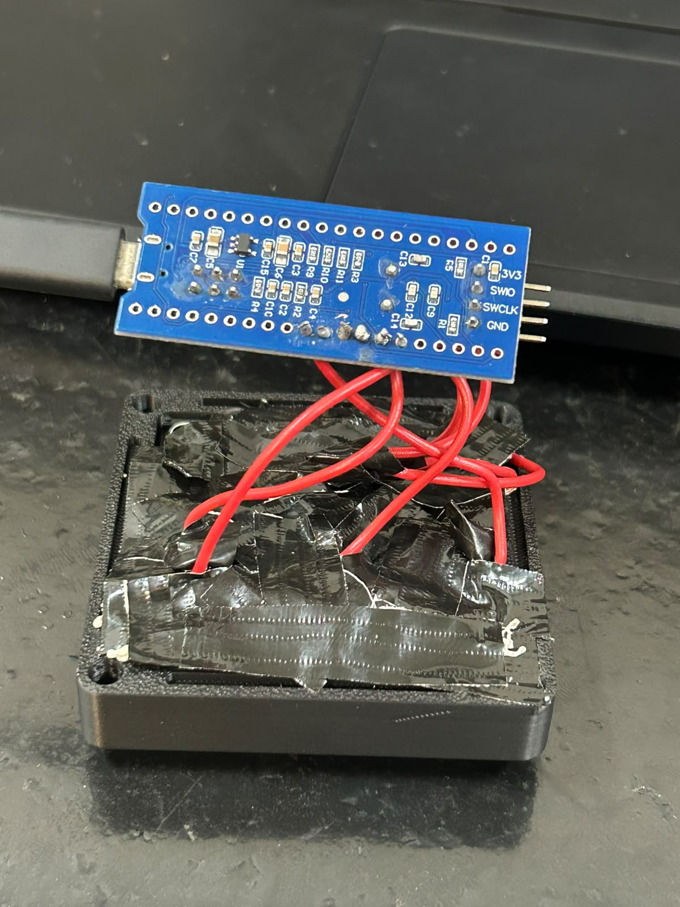

# ⌨️ StreamDeck Embedded System — STM32F103C8T6 (Blue Pill)

[](https://www.st.com)
[](https://www.usb.org)
[](#-arquitetura-do-firmware-e-interrupção-tim2)
[](https://www.kicad.org)
[](https://www.feelt.ufu.br)

Projeto prático desenvolvido para a disciplina de **Sistemas Embarcados I** da **Faculdade de Engenharia Elétrica (FEELT)** da **Universidade Federal de Uberlândia (UFU)**, sob orientação do **Prof. Jeovane Vicente de Sousa**.

---

## 📸 Fotos do Protótipo Finalizado & Montagem Física

<div align="center">

| 🚀 Protótipo Final em Carcaça 3D | 🛠️ Montagem Física e Fiação Interna |
| :---: | :---: |
|  |  |

</div>

---

## 🛠️ Especificações Técnicas de Engenharia

- **Microcontrolador:** ARM Cortex-M3 (STM32F103C8T6 - Blue Pill @ 72 MHz SYSCLK).
- **Interface USB:** USB Full-Speed 12 Mbps nativa com clock dedicado de 48 MHz (USBCLK).
- **Matriz de Teclas:** Matriz 3x3 (9 teclas mecânicas padrão Cherry MX / Outemu Blue de 3 pinos com encaixe $14\,\text{mm} \times 14\,\text{mm}$).
- **Anti-Ghosting:** 9 diodos de sinal $1\text{N}4148$ integrados em cada chave.
- **Arquitetura de Firmware:** **100% direcionada a Interrupção de Hardware por Timer (TIM2 a 100 Hz / 10 ms)** com filtro de debouncing de 40 ms por máquina de estados e desativação de *polling* no loop principal (`while(1)` ocioso com `__WFI()`).
- **Re-enumeração USB por Software:** Pulso de reset de 100 ms na linha USB D+ (`PA12`) na inicialização para forçar a identificação imediata no Windows/Linux após gravações no ST-LINK.
- **PCB KiCad:** Placa de Circuito Impresso em **Camada Única (Face Simples `B.Cu`)** com trilhas engrossadas de $0.8\,\text{mm}$ a $1.2\,\text{mm}$ para confecção por corrosão artesanal manual com Percloreto de Ferro.
- **Gabinete & Teclas:** Carcaça impressa em 3D (arquivos STL inclusos), insertos roscados M3 em latão e parafusos M3x8mm.

---

## ⚡ Arquitetura do Firmware e Interrupção TIM2

O firmware foi totalmente projetado para eliminar o uso ineficiente de *polling* e atrasos de software no loop principal:

```c
/**
 * @brief Callback de Interrupção do Timer TIM2 (100 Hz / 10ms)
 * @details Executa a varredura da matriz 3x3 e debouncing não-bloqueante de 40ms em ISR.
 */
void HAL_TIM_PeriodElapsedCallback(TIM_HandleTypeDef *htim) {
    if (htim->Instance == TIM2) {
        int current_key = scanMatrix_ISR();
        if (current_key != last_raw_key) {
            sample_ticks = HAL_GetTick();
            last_raw_key = current_key;
        }
        if ((HAL_GetTick() - sample_ticks) >= 40) {
            if (current_key != stable_valid_key) {
                stable_valid_key = current_key;
                uint8_t hid_report[8] = {0};
                if (stable_valid_key != -1) {
                    hid_report[2] = 0x68 + stable_valid_key; // Scancodes F13 a F21
                }
                USBD_CUSTOM_HID_SendReport(&hUsbDeviceFS, hid_report, 8);
            }
        }
    }
}

int main(void) {
    HAL_Init();
    SystemClock_Config();

    /* Reset forçado de software no pino USB D+ (PA12) para re-enumeração no Windows */
    GPIO_InitTypeDef GPIO_InitStruct_USB = {0};
    __HAL_RCC_GPIOA_CLK_ENABLE();
    GPIO_InitStruct_USB.Pin = GPIO_PIN_12;
    GPIO_InitStruct_USB.Mode = GPIO_MODE_OUTPUT_PP;
    GPIO_InitStruct_USB.Speed = GPIO_SPEED_FREQ_LOW;
    HAL_GPIO_Init(GPIOA, &GPIO_InitStruct_USB);
    HAL_GPIO_WritePin(GPIOA, GPIO_PIN_12, GPIO_PIN_RESET);
    HAL_Delay(100);

    /* Habilita depuração SWD do ST-LINK mesmo com CPU em modo repouso __WFI */
    HAL_DBGMCU_EnableDBGSleepMode();

    MX_GPIO_Init();
    MX_USB_DEVICE_Init();
    MX_TIM2_Init();

    HAL_TIM_Base_Start_IT(&htim2); // Ativa Interrupção TIM2 (100 Hz)

    while (1) {
        __WFI(); // CPU adormecida em baixo consumo (Wait For Interrupt)
    }
}
```

---

## 📊 Estrutura do Repositório

```text
├── Projeto Pronto.jpeg         # Foto do protótipo finalizado em carcaça 3D
├── Montagem.jpeg               # Foto da fiação interna e soldagem dos diodos
├── StreamDeck_SEMB.pdf         # Relatório Técnico Oficial & Memorial Descritivo (PDF)
├── relatorio_streamdeck.tex    # Código-fonte completo em LaTeX (Overleaf)
├── generate_pdf_report.py      # Script de compilação automatizada em Python
├── streamdeck bluepill/        # Código-fonte C STM32CubeIDE & Projeto CubeMX (.ioc)
├── PCB/                        # Projeto do KiCad e Gerbers da PCB Face Simples
├── PCB_FINAL/                  # Arquivos finais da PCB KiCad e Gerbers atualizados
├── dashboard/                  # Dashboard interativo web (HTML5/JS) para telemetria
├── *.stl                       # Arquivos de modelagem 3D para impressão do gabinete
└── README.md                   # Documentação oficial do projeto
```

---

## 👥 Equipe de Desenvolvimento (Discentes)

| Nome | Matrícula | Curso |
| :--- | :---: | :---: |
| **Gustavo Martins Ribeiro Moura** | `12111ETE002` | Engenharia Eletrônica |
| **Mateus Henrique Gonçalves** | `12311ECP021` | Engenharia de Computação |
| **Vicenzo De Marco Olivalves** | `12421ECP006` | Engenharia de Computação |

**Docente Responsável:** Prof. Jeovane Vicente de Sousa  
**Instituição:** Universidade Federal de Uberlândia (UFU) — Faculdade de Engenharia Elétrica (FEELT)  
**Ano:** 2026
